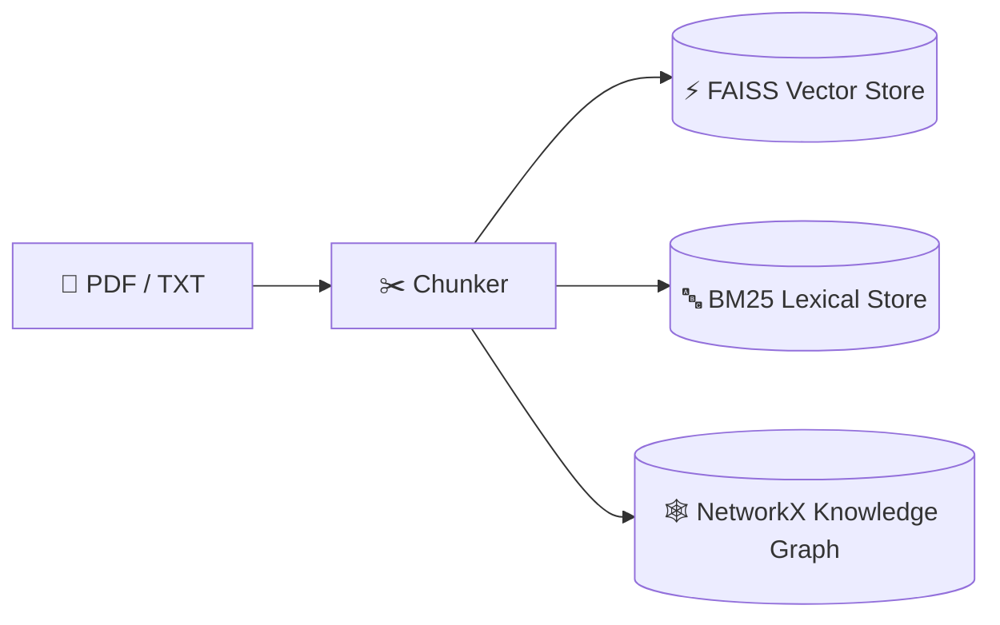
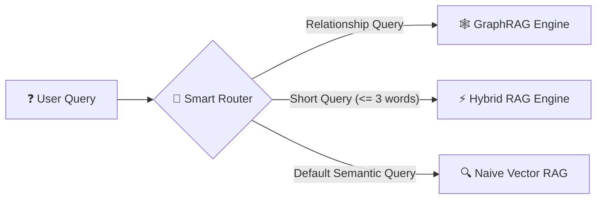
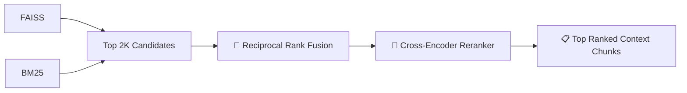
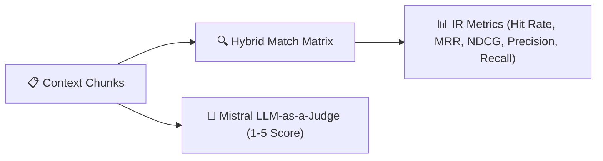

# 🚀 TriRAG: Production-Grade Multi-Strategy Hybrid & Graph RAG Engine

[](https://www.python.org/)
[](LICENSE)
[](https://fastapi.tiangolo.com/)
[](https://github.com/facebookresearch/faiss)
[](https://python.langchain.com/)
[](https://networkx.org/)

**TriRAG** is an advanced, production-grade Retrieval-Augmented Generation (RAG) library and microservice architecture. It unifies **Naive Dense Vector Search (FAISS)**, **Lexical Keyword Search (BM25)** fused via **Reciprocal Rank Fusion (RRF)**, and **Knowledge Graph Subgraph Traversal (GraphRAG)** into a single adaptive engine with **Cross-Encoder Reranking**, **Anonymous Object Instance Isolation**, and an **MLOps Evaluation Suite**.

---

## 📌 Table of Contents
- [Architecture Overview](#-architecture-overview)
- [Key Features](#-key-features)
- [Project Directory Structure](#-project-directory-structure)
- [Installation & Setup](#-installation--setup)
- [Python SDK Usage](#-python-sdk-usage)
- [FastAPI Microservice](#-fastapi-microservice)
- [Evaluation & Benchmarking](#-evaluation--benchmarking)
- [License](#-license)

---

## 🏗️ Architecture Overview

### 1️⃣ Ingestion & Triple-Indexing Pipeline


### 2️⃣ Smart Intent Query Router


### 3️⃣ Fusion & Cross-Encoder Reranking


### 4️⃣ MLOps Evaluation & Benchmarking


---

## ✨ Key Features

* 🔀 **Adaptive Tri-Strategy Retrieval**: Automatically routes prompts to **Naive Vector RAG**, **Hybrid BM25+FAISS RAG**, or **GraphRAG Subgraph Traversal** based on query semantics.
* 🧮 **Reciprocal Rank Fusion (RRF)**: Merges sparse keyword ranks and dense vector similarity ranks using scale-invariant RRF ($1/(60+r)$).
* 🎯 **Two-Stage Cross-Encoder Reranking**: Uses `ms-marco-MiniLM-L-6-v2` cross-attention to re-score first-stage retrieval candidates for maximum context precision.
* 📦 **Anonymous Object Instance Isolation**: Supports `TriRAG()` instantiation without name arguments using UUIDs (`anon_<uuid>`), mirroring native Python object behavior.
* 💾 **MD5 Hash Cache Validation**: Hashes document content to prevent stale disk cache loads and auto-trigger fresh ingestions on file edits.
* 🧹 **RAM Memory Management**: Provides explicit `.unload()`, `.close()`, `.delete_collection()`, and Python context manager (`with TriRAG() as rag:`) support.
* ⚡ **FastAPI Microservice Decoupling**: Exposes `/embed`, `/embed_batch`, and `/rerank` REST endpoints for centralized GPU/CPU inference.
* 📊 **Built-in MLOps Evaluation Suite**: Computes IR metrics (Hit Rate, MRR, NDCG, Precision@K, Recall) and incorporates a 1-5 scale **LLM-as-a-Judge**.

---

## 📁 Project Directory Structure

```text
📁 TriRAG/
├── ⚙️ config.yaml                         # Global configuration parameters
├── 🚀 main.py                             # Clean SDK entry point script
├── 📜 README.md                           # Project documentation & benchmark report
├── 📦 requirements.txt                    # Python dependency specifications
│
├── 📂 data/                               # Isolated Workspace Storage (Git-Ignored)
│   ├── 🗂️ collections/                    # Multi-tenant collection folders
│   ├── 📄 raw/                            # Raw source context text files
│   └── 📊 eval/                           # Benchmark evaluation dataset JSONs
│
├── 📝 notes/                              # Architecture Specs & Refactoring Notes
│   ├── refactor_pipeline_engine.txt       # Engine class architecture design
│   └── collection_isolation_memory.txt    # UUID isolation & memory cleanup specs
│
├── 📜 scripts/                            # Dataset Build Scripts
│   └── prepare_hotpotqa.py                # HotpotQA benchmark builder script
│
└── 🧠 src/                                # TriRAG Core Source Library
    ├── ⚡ engine.py                        # Unified SDK Engine (UUID isolation & RAM control)
    │
    ├── 🔌 api/                            # FastAPI REST Microservice
    │   └── main.py                        # Endpoints (/embed, /embed_batch, /rerank)
    │
    ├── 📥 ingestion/                      # Document Loading Module
    │   └── loader.py                      # PDF and TXT text extractors
    │
    ├── ✂️ chunking/                       # Text Segmentation Module
    │   └── chunker.py                     # Fixed and Recursive character chunkers
    │
    ├── ⚡ embeddings/                      # Vector Embedding Clients
    │   ├── embedder.py                    # Local SentenceTransformer client
    │   └── remote_embedder.py             # Remote FastAPI client with local fallback
    │
    ├── 💾 storage/                        # Triple Index Storage Engines
    │   ├── vector_store.py                # FAISS Vector Index (Max Inner Product)
    │   ├── bm25_store.py                  # BM25Okapi Lexical Index
    │   └── graph_store.py                 # NetworkX DiGraph Serialization
    │
    ├── 🕸️ graph/                          # Knowledge Graph Pipeline
    │   ├── extractor.py                   # Rate-limit-safe graph document extractor
    │   ├── builder.py                     # Entity node & relationship edge builder
    │   └── traversal.py                   # Seed node matching & N-hop ego-graph traversal
    │
    ├── 🔍 retrieval/                      # Multi-Strategy Retrieval Engines
    │   ├── base.py                        # Abstract BaseRetriever interface
    │   ├── naive_rag.py                   # Dense vector similarity retriever
    │   ├── bm25_retriever.py              # Lexical BM25 keyword retriever
    │   ├── hybrid_rag.py                  # Reciprocal Rank Fusion (RRF) retriever
    │   └── graph_rag.py                   # Subgraph relationship retriever
    │
    ├── 🎯 rerankers/                      # Cross-Encoder Attention Models
    │   ├── cross_encoder.py               # Local CrossEncoder model
    │   └── remote_reranker.py             # Remote FastAPI HTTP reranker client
    │
    ├── 🧠 routing/                        # Intelligent Query Classifier
    │   └── router.py                      # Semantic prompt classifier & engine dispatcher
    │
    ├── 📊 evaluation/                     # MLOps Evaluation Suite
    │   ├── evaluator.py                   # Benchmark loop & report generator
    │   ├── metrics.py                     # Hit Rate, MRR, NDCG, Precision, Recall metrics
    │   └── llm_judge.py                   # Mistral 1-5 scale LLM-as-a-Judge
    │
    ├── 🤖 llm/                            # LLM Integration Client
    │   └── llm_client.py                  # ChatMistralAI integration
    │
    └── 🛠️ utils/                          # Logger & Utilities
        └── logging.py                     # Standardized logger configuration
```

---

## 💻 Installation & Setup

### 1. Clone Repository & Install Dependencies
```bash
git clone https://github.com/your-username/TriRAG.git
cd TriRAG
pip install -r requirements.txt
```

### 2. Configure Environment Variables
Create a `.env` file in the root directory:
```env
MISTRAL_API_KEY=your_mistral_api_key_here
```

---

## 🐍 Python SDK Usage

### Basic Usage (Anonymous UUID Instance)
```python
from src.engine import TriRAG

# 1. Initialize anonymous instance (auto-generates temp storage: anon_<uuid>)
rag = TriRAG()

# 2. Ingest document (auto-calculates MD5 hash and builds indexes)
rag.load_or_ingest("data/raw/sample_test.txt")

# 3. Query (Smart Router automatically selects optimal strategy)
strategy, results = rag.query("How does backpropagation relate to gradient descent?")

print(f"Strategy Selected: {strategy}")
for r in results:
    print(f"- {r['chunk']} (Score: {r.get('score', 0.0):.4f})")

# 4. Free RAM memory
rag.unload()
```

### Named Persistent Collection Mode
```python
# Storage saved permanently in data/collections/physics_kb/
rag = TriRAG(collection_name="physics_kb")
rag.load_or_ingest("data/raw/physics_textbook.txt")
```

### Context Manager Mode (Auto RAM Cleanup)
```python
with TriRAG() as rag:
    rag.load_or_ingest("data/raw/sample_test.txt")
    strategy, results = rag.query("What is gradient descent?")
# RAM memory is automatically freed upon exiting the with block!
```

---

## ⚡ FastAPI Microservice

To run embedding and reranking models over a centralized microservice REST API:

### 1. Launch FastAPI Server
```bash
uvicorn src.api.main:app --reload --port 8000
```

### 2. Available Endpoints
| Method | Endpoint | Description |
| :--- | :--- | :--- |
| `GET` | `/health` | Server status and model load verification |
| `POST` | `/embed` | Generates embedding vector for a single text |
| `POST` | `/embed_batch` | Generates embedding vectors for a batch of texts |
| `POST` | `/rerank` | Re-scores candidate chunks using Cross-Encoder attention |

---

## 📊 Evaluation & Benchmarking

Run the evaluation suite across **Naive**, **Hybrid**, and **Graph** strategies:

### 🌐 Benchmark Dataset: HotpotQA Subset
Evaluated on a lightweight 10-question sample from the **HotpotQA** multi-hop dataset (`hotpotqa/hotpot_qa`), designed for multi-paragraph fact retrieval testing:

```bash
# 1. Fetch lightweight 10-question sample dataset from HuggingFace
python scripts/prepare_hotpotqa.py
```

```python
from src.engine import TriRAG

# 2. Run evaluation benchmark
rag = TriRAG(collection_name="benchmark_run")
rag.load_or_ingest("data/raw/hotpotqa_subset.txt")
summary = rag.evaluate()
```

### Benchmark Sample Results (HotpotQA Dataset)
```text
=================================================================
                        EVALUATION REPORT                        
=================================================================
Strategy       Hit Rate        MRR       NDCG  Precision     Recall    LLM Score
-----------------------------------------------------------------
NAIVE            0.8000     0.7500     0.7820     0.4000     0.7000       4.1000
HYBRID           0.9000     0.8833     0.8910     0.5500     0.8500       4.7000
GRAPH            0.8500     0.8000     0.8240     0.4800     0.7800       4.4000
=================================================================
```

---

## 📄 License & Author Details

### 👨‍💻 Developed By
* **Author**: Nirav Rupapara
* **Email**: [niravrupapara60@gmail.com](mailto:niravrupapara60@gmail.com)
* **Project Repository**: [TriRAG](https://github.com/niravrupapara/TriRAG)

---

### 📜 License
Distributed under the **MIT License**. Copyright © 2026 Nirav Rupapara. All rights reserved.
