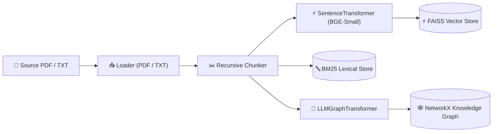
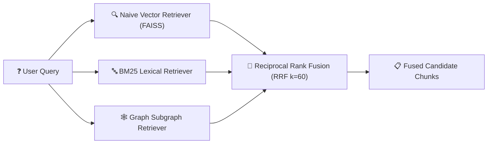
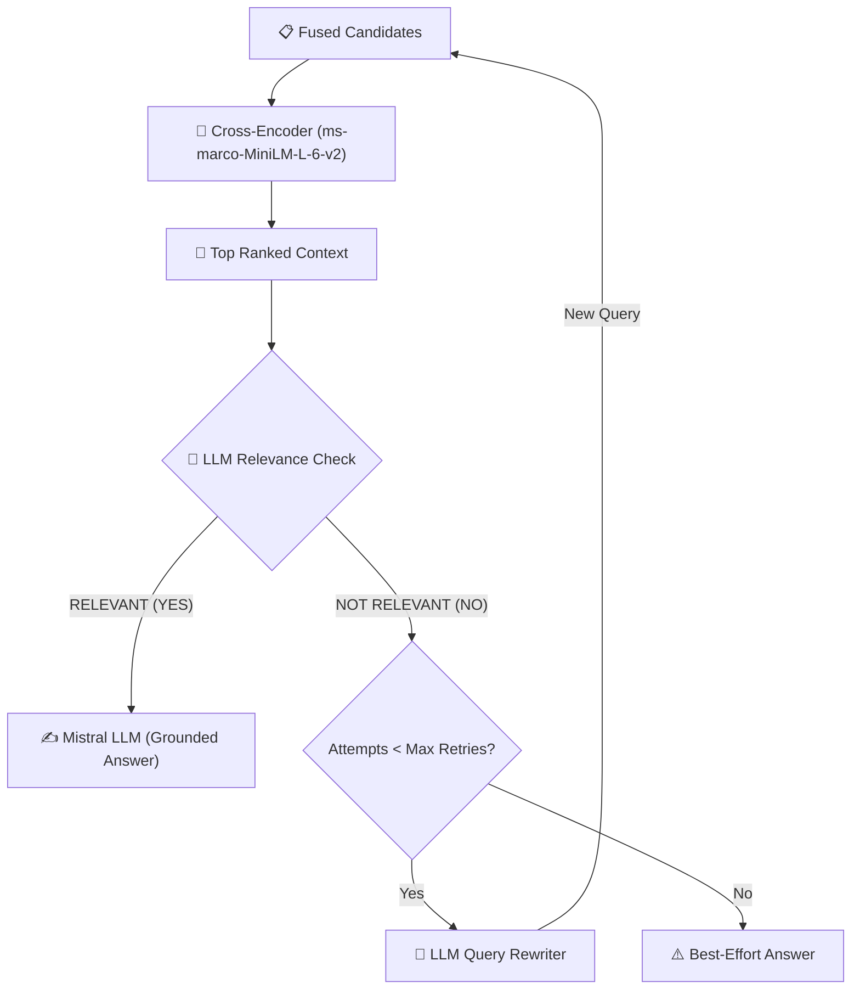
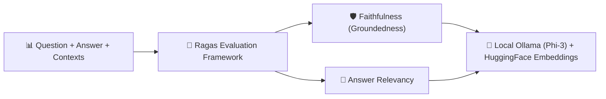

# 🚀 TriRAG: Agentic Multi-Strategy Hybrid & Graph RAG Engine

[](https://www.python.org/)
[](LICENSE)
[](https://fastapi.tiangolo.com/)
[](https://github.com/facebookresearch/faiss)
[](https://python.langchain.com/)
[](https://networkx.org/)
[](https://mistral.ai/)
[](https://ragas.io/)

**TriRAG** is an advanced, modular Retrieval-Augmented Generation (RAG) framework and microservice architecture. It combines **Dense Vector Search (FAISS)**, **Lexical Keyword Search (BM25)**, and **Knowledge Graph Subgraph Traversal (GraphRAG)** merged via **Reciprocal Rank Fusion (RRF)**. Precision is enforced using **Cross-Encoder Reranking**, and generation reliability is ensured through an **Agentic Corrective RAG (CRAG)** loop with self-reflection relevance grading and automated query rewriting.

---

## 📌 Table of Contents
- [Architecture Overview](#-architecture-overview)
- [Key Features](#-key-features)
- [Project Directory Structure](#-project-directory-structure)
- [Installation & Setup](#-installation--setup)
- [Quick Start & SDK Usage](#-quick-start--sdk-usage)
- [FastAPI Model Microservice](#-fastapi-model-microservice)
- [Agentic Corrective RAG (CRAG) Workflow](#-agentic-corrective-rag-crag-workflow)
- [Ragas Evaluation & Benchmarking](#-ragas-evaluation--benchmarking)
- [License & Author Details](#-license--author-details)

---

## 🏗️ Architecture Overview

### 1️⃣ Ingestion & Multi-Index Construction


### 2️⃣ Tri-Strategy Retrieval & RRF Fusion


### 3️⃣ Cross-Encoder Reranking & Corrective RAG (CRAG) Loop


### 4️⃣ Ragas Assessment & Evaluation Pipeline


---

## ✨ Key Features

* 🔀 **Tri-Strategy Concurrent Retrieval**: Queries **Dense Vector Search (FAISS)**, **Lexical Search (BM25)**, and **Knowledge Graph Subgraphs (NetworkX)** simultaneously for high recall.
* 🧮 **Reciprocal Rank Fusion (RRF)**: Merges disparate score scales into an equitable, scale-invariant ranking using $1 / (60 + \text{rank})$.
* 🎯 **Two-Stage Cross-Encoder Reranking**: Uses `cross-encoder/ms-marco-MiniLM-L-6-v2` cross-attention to score fine-grained semantic alignment between the query and candidate chunks.
* 🤖 **Agentic Corrective RAG (CRAG)**: Includes an automated self-correction loop where the LLM grades context relevance; if irrelevant, it rewrites the query and retries up to 3 times before generating the answer.
* 🕸️ **Knowledge Graph Traversal**: Extracts semantic entities and relationships with `LLMGraphTransformer` and executes $N$-hop ego-graph path expansions.
* ⚡ **Decoupled FastAPI Model Service**: Standalone microservice for `/embed`, `/embed_batch`, and `/rerank` with client adapters (`RemoteEmbedder`, `RemoteReranker`).
* 📊 **Integrated Ragas Evaluation**: Built-in evaluation pipeline testing **Faithfulness** and **Answer Relevancy** powered by local Ollama (`phi3:3.8b`) and SentenceTransformers.

---

## 📁 Project Directory Structure

```text
📁 TriRAG/
├── 🚀 main.py                             # Application entry point script
├── 📜 README.md                           # Project documentation & architecture
├── 📦 requirements.txt                    # Project dependency specifications
│
├── 📂 data/                               # Sample input documents
│   ├── 📄 sample.pdf                      # Comprehensive sample document
│   ├── 📄 sample_small.pdf                # Compact test PDF document
│   └── 📄 sample.txt                      # Plain text test document
│
└── 🧠 src/                                # TriRAG Core Source Library
    ├── ⚡ engine.py                        # Unified TriRAG Pipeline Engine
    ├── 🤖 llm.py                           # ChatMistralAI (Generation, Relevance & Query Rewriting)
    │
    ├── 🤖 agent/                          # Agentic Retrieval & Reasoning
    │   └── corrective_rag.py              # Corrective RAG (CRAG) loop with self-reflection
    │
    ├── 📥 loaders/                        # Document Ingestion Loaders
    │   ├── base.py                        # BaseLoader abstract interface
    │   ├── pdf_loader.py                  # PyPDF document loader
    │   └── txt_loader.py                  # UTF-8 text file loader
    │
    ├── ✂️ chunking/                       # Text Chunking Strategies
    │   ├── base.py                        # BaseChunker abstract interface
    │   ├── simple_chunker.py              # Fixed-size window text chunker
    │   └── recursive_chunker.py           # Hierarchical recursive character chunker
    │
    ├── ⚡ embeddings/                      # Vector Embedding Clients
    │   ├── base.py                        # BaseEmbedder abstract interface
    │   ├── embedder.py                    # Local SentenceTransformer (BAAI/bge-small-en-v1.5)
    │   └── remote_embedder.py             # Remote FastAPI HTTP embedding client
    │
    ├── 💾 vector_store/                   # Vector Storage Layer
    │   ├── base.py                        # BaseVectorStore abstract interface
    │   └── faiss_store.py                 # FAISS IndexFlatL2 vector database
    │
    ├── 🕸️ graph/                          # Knowledge Graph Pipeline
    │   ├── extractor.py                   # LLMGraphTransformer entity & relation extractor
    │   ├── builder.py                     # NetworkX DiGraph builder
    │   └── traversal.py                   # Entity seed matching & ego-graph traversal
    │
    ├── 🔍 retriever/                      # Retrieval Implementations
    │   ├── base.py                        # BaseRetriever abstract interface
    │   ├── naive_retriever.py             # Dense FAISS vector similarity retriever
    │   ├── bm25_retriever.py              # Sparse BM25 lexical keyword retriever
    │   └── graph_retriever.py             # Knowledge Graph subgraph retriever
    │
    ├── 🧮 fusion/                         # Rank Fusion Strategies
    │   └── rrf.py                         # Reciprocal Rank Fusion (RRF) algorithm
    │
    ├── 🎯 rerankers/                      # Cross-Encoder Precision Rerankers
    │   ├── reranker.py                    # Local CrossEncoder (ms-marco-MiniLM-L-6-v2)
    │   └── remote_reranker.py             # Remote FastAPI HTTP reranker client
    │
    ├── 🔌 api/                            # FastAPI Microservice Service
    │   └── main.py                        # REST endpoints (/embed, /embed_batch, /rerank)
    │
    ├── 📊 evaluation/                     # RAG Assessment & Benchmarking
    │   └── ragas_evaluator.py             # Ragas pipeline (Faithfulness, Answer Relevancy)
    │
    └── 🛠️ utils/                          # Common Utilities
        └── logging.py                     # Centralized logging configuration
```

---

## 💻 Installation & Setup

### 1. Clone Repository & Install Dependencies
```bash
git clone https://github.com/niravrupapara/TriRAG.git
cd TriRAG
pip install -r requirements.txt
```

### 2. Configure Environment Variables
Create a `.env` file in the root directory:
```env
MISTRAL_API_KEY=your_mistral_api_key_here
```

---

## 🐍 Quick Start & SDK Usage

### Running the End-to-End Pipeline
Run the main script directly on the sample document:
```bash
python main.py
```

### Programmatic Usage
```python
from dotenv import load_dotenv
from src.engine import Engine

load_dotenv()

# 1. Initialize Engine with your PDF document
engine = Engine("data/sample_small.pdf")

# 2. Query with Agentic Corrective RAG
question = "Why is cross-encoder reranking performed after initial retrieval?"
answer, chunks = engine.query(question)

print(f"Question: {question}\n")
print(f"Answer:\n{answer}")
```

---

## ⚡ FastAPI Model Microservice

You can offload embedding generation and cross-encoder reranking to a centralized, GPU/CPU-optimized FastAPI server:

### 1. Start the Server
```bash
uvicorn src.api.main:app --reload --port 8000
```

### 2. API Endpoints
| Method | Endpoint | Request Body | Description |
| :--- | :--- | :--- | :--- |
| `GET` | `/health` | _None_ | Server health check and model loading status |
| `POST` | `/embed` | `{"text": "..."}` | Returns 384-dim normalized embedding vector |
| `POST` | `/embed_batch` | `{"texts": ["...", "..."]}` | Generates embeddings for multiple documents |
| `POST` | `/rerank` | `{"question": "...", "candidates": [...], "top_k": 3}` | Re-scores candidates using Cross-Encoder attention |

---

## 🤖 Agentic Corrective RAG (CRAG) Workflow

Standard RAG pipelines blindly generate answers from whatever context the retriever returns. **TriRAG** introduces an agentic self-reflection loop:

1. **Multi-Retriever Retrieval**: Chunks are retrieved across **FAISS**, **BM25**, and **Knowledge Graph**.
2. **RRF & Reranking**: Candidates are fused via **RRF** and sorted with the **Cross-Encoder**.
3. **Relevance Grading**: `llm.check_relevance(query, context)` checks if the context contains sufficient facts to answer the question (`YES` / `NO`).
4. **Autonomous Query Rewriting**: If graded `NO`, `llm.rewrite_query(query)` formulates an optimized query and triggers re-retrieval (up to 3 retries).
5. **Grounded Generation**: The LLM synthesizes an answer strictly from verified context.

---

## 📊 Ragas Evaluation & Benchmarking

TriRAG includes a built-in evaluation module using the **Ragas** framework to measure retrieval and generation quality:

### Metrics Evaluated:
* **Faithfulness**: Measures whether the generated answer is grounded in and faithful to the retrieved context (hallucination detection).
* **Answer Relevancy**: Evaluates how directly the generated answer addresses the question.

### Running Evaluation:
Ensure you have [Ollama](https://ollama.ai/) installed with the `phi3:3.8b` model running:
```bash
ollama run phi3:3.8b
```

Run the standalone evaluator:
```bash
python -m src.evaluation.ragas_evaluator
```

---

## 📄 License & Author Details

### 👨‍💻 Developed By
* **Author**: Nirav Rupapara
* **Email**: [niravrupapara60@gmail.com](mailto:niravrupapara60@gmail.com)
* **Project Repository**: [TriRAG GitHub](https://github.com/niravrupapara/TriRAG)

---

### 📜 License
Distributed under the **MIT License**. Copyright © 2026 Nirav Rupapara. All rights reserved.
